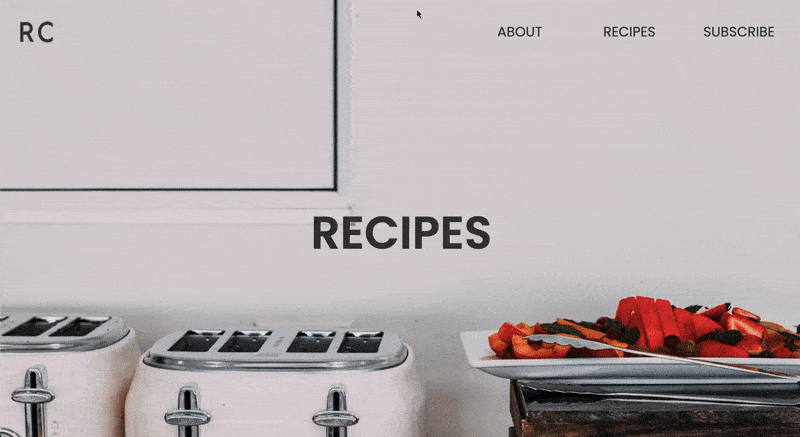

## Pair Programming Challenge

<i>Projeto desenvolvido como desafio referente ao módulo 2 do curso Vai na Web de desenvolvimento front-end. </i>  

    
    
    
    

 

Nesse projeto, fomos instigados a trabalhar em dupla para entregar uma landing-page moderna e minimalista.

Todos os parâmetros foram combinados previamente e não houve problemas sensíveis na execução. O resultado final ficou uniforme e padronizado, ao mesmo tempo em que conseguiu expressar nossa personalidade no código.

Como melhoria futura, pretendemos colocar o botão mobile em funcionamento.

## PREVIEW

  

  
  

 

    
    

